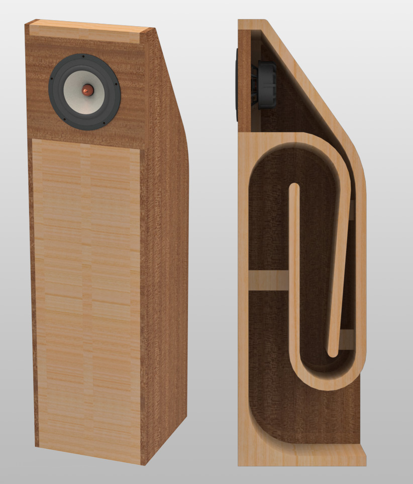
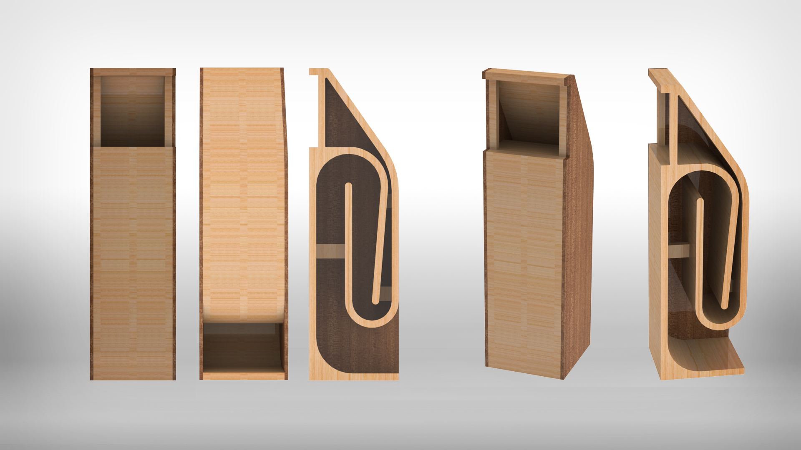
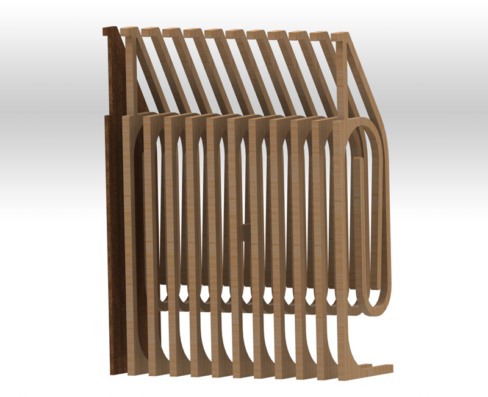
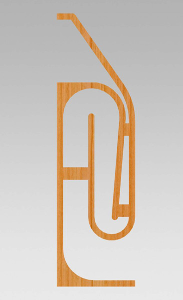
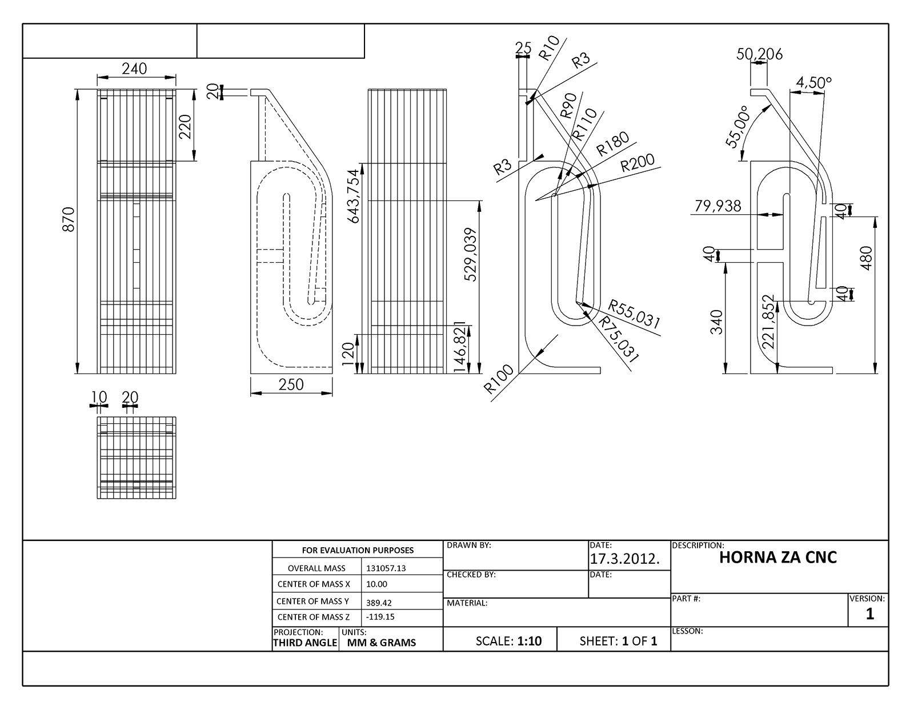

## HORNE 

Prototype idea for creating loudspeaker (cut with CNC) 

### Details
- Mass 131057.13 grams
- Volume 16802195.97 cubic millimeters
- Surface 3307410.45 square millimeters

_Built with SolidWorks_
